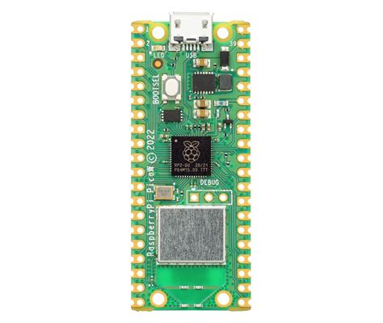

# CRFC Starter Robot Platform

## Overview

This firmware repository supports the Raspberry Pi Pico W and the Playstation Dualshock 4 controller.




## Pre-Requisites

### Windows & Linux

Install Windows Subsystem for Linux (wsl).

Launch WSL and install the following:

```bash
sudo apt install git cmake gcc-arm-none-eabi libnewlib-arm-none-eabi libstdc++-arm-none-eabi-newlib
```

### MacOS

Install homebrew.

Launch the terminal an use homebrew to install the build tools

```bash
brew install cmake
brew tap ArmMbed/homebrew-formulae
brew install arm-none-eabi-gcc
```

## Project Setup

Clone the repo:

```bash
git clone https://github.com/ehunck/crfc-starter-robot.git
```

or use SSH

```bash
git clone git@github.com:ehunck/crfc-starter-robot.git
```

Update all of the submodules (This pulls in the pico-sdk.)

```bash
git submodule update --init --recursive
```

This repository was setup by following the instructions here:

https://www.raspberrypi.com/documentation/microcontrollers/c_sdk.html#quick-start-your-own-project

Install Prerequisites:

....

## Build the Project

```bash
mkdir build
cd build
cmake -DPICO_BOARD=pico_w -DPICO_SDK_PATH=../pico-sdk ../
cmake --build .
```

## Flash the Firmware

You now have `main_app.elf` to load via a debugger, or `main_app.uf2` that can be installed and run on your Raspberry Pi Pico via drag and drop.

## Develop with VSCode

This is optional, but VSCode can be used to edit and build the project.

Install `CMake Tools` Extension from Microsoft.

Run `>CMake: Configure` to setup the project to build.
Select the toolchain which should be `gcc-arm-none-eabi`.  

Run `>CMake: Build Target` to select the build target.
Select the target which should be `main_app`.
